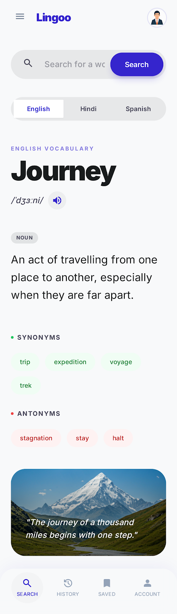
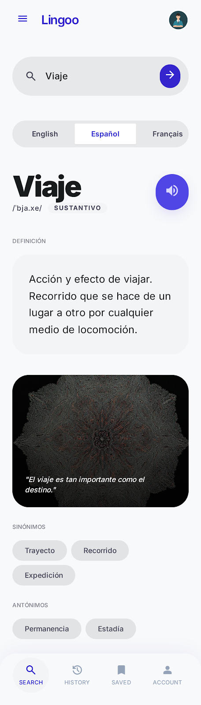
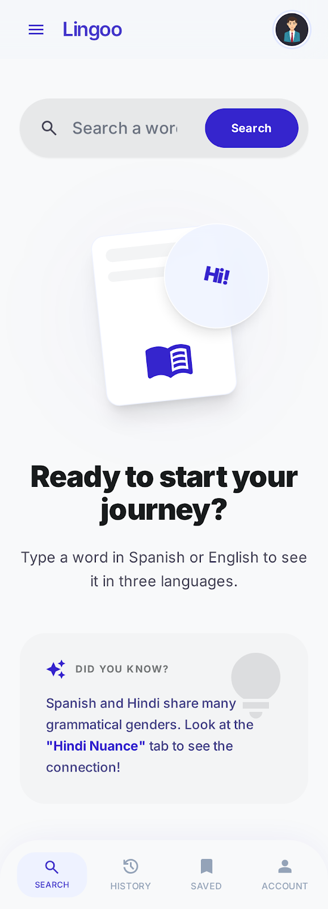

# 🌐 Lingoo

### *Trilingual Triangulation — Learn Spanish faster by speaking Hindi.*

[](https://react.dev)
[](https://www.typescriptlang.org)
[](https://tailwindcss.com)
[](https://vitejs.dev)
[](https://openai.com)
[](https://vercel.com)

---

## 🧠 The Problem — The Hindi-Spanish Link

Most Spanish learning apps are designed for English speakers. But for the **~600 million native Hindi speakers** in the world, there's a largely untapped shortcut hiding in plain sight.

Spanish and Hindi share something English doesn't: **grammatical gender**. Every noun in both languages is either masculine or feminine. When a Hindi speaker learns that *"agua"* (water) is feminine in Spanish, they already have a mental framework for what that means — because *"पानी"* works the same way.

> **English loses this context entirely.** "Water" is just… water.

Lingoo is built on this insight. Instead of translating through English, it **triangulates** — surfacing the grammatical, phonetic, and nuance connections between Hindi and Spanish that no other app exposes.

---

## ✨ Product Features

### 🔍 Instant Trilingual Lookup
Type any word — in English, Spanish, or Hindi — and get a rich, structured definition in all three languages simultaneously. Powered by GPT-4o-mini with a carefully crafted system prompt that enforces consistent linguistic structure.

### 🧬 Hindi Nuance Engine
The crown feature. For every word, Lingoo surfaces a **comparative grammar note** that explains:
- The grammatical gender of the Hindi word (masculine पुल्लिंग / feminine स्त्रीलिंग)
- How it compares to the Spanish equivalent's gender
- The linguistic insight that helps a Hindi speaker *feel* Spanish intuitively

Example: *"In Hindi, यात्रा is grammatically feminine (स्त्रीलिंग). Interestingly, the Spanish equivalent viaje is masculine (masculino) — a subtle divergence worth remembering."*

### 🔊 Native Pronunciation
One tap to hear any word spoken aloud — in the correct language and accent — using the Web Speech Synthesis API. Works for Devanagari script, Spanish, and English.

### 📚 Persistent Word Library
Save words to a personal library, persisted in localStorage. Saved words load instantly (cache-first) with the option to refresh from the API. Never lose a word you looked up.

### 🕓 Smart Search History
Every search is automatically logged with a relative timestamp. History is deduplicated, filterable, and replayable — tap any past word to re-run the lookup instantly. Vocabulary stats (words today, total words) surface in a bento grid.

---

## 📸 Gallery

<table>
  <tr>
    <td align="center"><b>English View</b></td>
    <td align="center"><b>Hindi View</b></td>
    <td align="center"><b>Spanish View</b></td>
  </tr>
  <tr>
    <td></td>
    <td></td>
    <td></td>
  </tr>
  <tr>
    <td align="center"><b>History</b></td>
    <td align="center"><b>Saved Words</b></td>
    <td align="center"><b>Empty State</b></td>
  </tr>
  <tr>
    <td></td>
    <td></td>
    <td></td>
  </tr>
</table>

---

## 🏗️ System Architecture

```
Browser (React + Vite)
    │
    │  POST /api/lookup { word }
    ▼
Vercel Serverless Function (api/lookup.ts)
    │
    │  x-portkey-api-key
    │  x-portkey-virtual-key
    │  x-portkey-metadata: { search_word, project }
    ▼
Portkey AI Gateway (portkey.ai)
    │
    │  Routes to GPT-4o-mini
    ▼
OpenAI API → Structured JSON (en + hi + es)
    │
    ▼
Cost Calculation → debug { tokens, costUSD, costINR }
    │
    ▼
Response to client (TrilingualEntry)
```

### 🔐 Secure by Default
The OpenAI API key **never touches the browser**. All LLM calls are routed through a Vercel serverless function, keeping credentials server-side.

### 📊 Portkey Observability Layer
Every request passes through [Portkey](https://portkey.ai) as an AI gateway, enabling:
- **Request tracing** with per-word metadata (`search_word` tag)
- **Cost monitoring** in both USD and INR (₹ calculated at 83.5 rate)
- **Model routing** — swap the underlying model without touching frontend code

---

## 🛠️ Tech Stack

| Layer | Technology |
|---|---|
| Frontend | React 18 + Vite + TypeScript |
| Styling | Tailwind CSS + Material Design 3 tokens |
| Icons | lucide-react |
| State | React Hooks + localStorage |
| Backend | Vercel Serverless Functions |
| AI | OpenAI GPT-4o-mini via Portkey |
| Deployment | Vercel |

---

## 🚀 Local Setup

```bash
# 1. Clone the repo
git clone https://github.com/your-username/lingoo.git
cd lingoo

# 2. Install dependencies
npm install

# 3. Set up environment variables
cp .env.example .env
# Add your keys to .env:
# PORTKEY_API_KEY=...
# PORTKEY_VIRTUAL_KEY=...

# 4. Run locally (with serverless functions)
npx vercel dev
```

Open [http://localhost:3000](http://localhost:3000) to start looking up words.

---

## 📄 License

MIT
